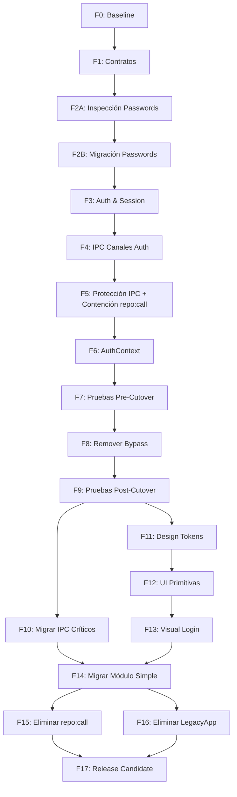

# PHASED IMPLEMENTATION MASTER PLAN (V3)

## 1. RESUMEN DE DEFECTOS DE V2
- **Anatomía Incompleta de Prompts:** Los prompts de V2 dependían de referencias vagas ("Bloque estándar"), impidiendo ejecución autónoma.
- **Validación Insuficiente del Emisor IPC:** V2 confiaba únicamente en `event.sender.id`, omitiendo la validación estricta de `event.senderFrame` y URLs permitidas, exponiendo el IPC a exploits de frames anidados.
- **Migración Directa Peligrosa:** V2 proponía una migración directa de contraseñas, lo cual es inaceptable en producción. Faltaba una inspección (dry-run) y validación en entorno de pruebas (Fases 2A y 2B).
- **SessionManager Limitado:** Faltaban atributos críticos de auditoría (`securityVersion`, `lastActivityAt`) y rutinas de invalidación explícitas para destrucción de ventanas.
- **Contención Tardía de `repo:call`:** V2 dejaba la contención en la Fase 9, manteniendo una vulnerabilidad crítica viva durante 8 fases previas. Se integró directamente en la Fase 5 junto a la protección IPC.
- **Cutover Ciego:** El bypass del login se eliminaba sin pruebas estructuradas pre-cutover, arriesgando el bloqueo total de la aplicación.
- **Módulos Combinados:** La migración progresiva mezclaba módulos gigantes en un solo prompt. V3 lo separa usando una plantilla escalable (Fase 14).

---

## 2. MATRIZ DE ESTADOS CORREGIDA

| Área          | Estado | Evidencia | Riesgo | Acción requerida |
| ------------- | ------ | --------- | ------ | ---------------- |
| Login         | PARTIAL | `LegacyApp.tsx` L29 | CRITICAL | Eliminar bypass tras tests pre-cutover (F8). |
| JWT/Opaca     | PARTIAL | `authMiddleware.ts` | HIGH | Implementar Sesión Opaca robusta. |
| Sesiones      | DEPRECATED | `localStorage` usado | HIGH | Usar AuthContext en F6. |
| IPC           | PARTIAL | `repo:call` expuesto | CRITICAL | Contener en F5, migrar en F10, borrar en F15. |
| Autorización  | NOT_STARTED | Sin validación Main | CRITICAL | Validar `senderFrame` y `role` en F5. |
| Router        | PARTIAL | `HashRouter` usado | LOW | Envolver con `ProtectedRoute`. |
| LegacyApp     | BLOCKED | 437 líneas | MEDIUM | Extraer dependencias una a una con F14. |
| Design System | NOT_STARTED | CSS global | MEDIUM | Crear F11 y F12. |
| Tests         | IMPLEMENTED_NOT_VERIFIED | `jest.config.js` | HIGH | Pruebas Pre y Post Cutover obligatorias. |
| CI/CD         | IMPLEMENTED_NOT_VERIFIED | `ci.yml` | LOW | Validar salida en F17. |
| SQL Server    | IMPLEMENTED_NOT_VERIFIED | Vista FP05C | LOW | Validar integridad en entorno de prueba. |

---

## 3. ROADMAP DEFINITIVO

- **Fase 0:** Baseline y preflight.
- **Fase 1:** Contratos compartidos de autenticación.
- **Fase 2A:** Inspección y dry-run de contraseñas.
- **Fase 2B:** Migración de contraseñas en entorno de prueba.
- **Fase 3:** AuthService y SessionManager.
- **Fase 4:** Canales IPC de autenticación.
- **Fase 5:** Protección y autorización IPC (Incluye contención de `repo:call`).
- **Fase 6:** AuthContext y rutas.
- **Fase 7:** Pruebas pre-cutover.
- **Fase 8:** Eliminación controlada del bypass.
- **Fase 9:** Pruebas post-cutover.
- **Fase 10:** Migración de canales IPC críticos.
- **Fase 11:** Design tokens y temas.
- **Fase 12:** Componentes UI base.
- **Fase 13:** Migración visual de Login, Shell y Dashboard.
- **Fase 14:** Migración progresiva de módulos (Plantilla).
- **Fase 15:** Eliminación final de `repo:call`.
- **Fase 16:** Reducción y eliminación de `LegacyApp.tsx`.
- **Fase 17:** Release Candidate.

---

## 4. GRAFO DE DEPENDENCIAS



---

## 5. REGISTRO DE RIESGOS AMPLIADO

| ID | Riesgo | Probabilidad | Impacto | Mitigación | Fase |
| -- | ------ | -----------: | ------: | ---------- | ---- |
| R01 | Bloqueo accidental de usuarios por hash mal formado | Alta | Crítico | Inspección en F2A y migración estricta de prueba en F2B. | 2A, 2B |
| R02 | Exploit de `repo:call` activo | Alta | Crítico | Contención inmediata con allowlist estricta y bloqueo destructivo en F5. | 5 |
| R03 | SenderFrame IPC falsificado | Media | Alto | Validación de URL de origen y Frame ID en middleware IPC. | 5 |
| R04 | Bloqueo fatal al remover bypass | Media | Crítico | Pruebas exhaustivas Pre-Cutover (F7). Rollback documentado si falla Post-Cutover (F9). | 7, 8, 9 |
| R05 | Roles o permisos confiados desde Frontend | Alta | Crítico | Backend consulta BD y almacena en `SessionManager`. Jamás confiar en payload cliente. | 3, 5 |
| R06 | Fugas de Memoria en SessionManager | Baja | Medio | Limpieza activa al dispararse el evento `window-all-closed` o destrucción de `webContents`. | 3 |
| R07 | CSS Global corrompe Módulos Antiguos | Alta | Medio | Scoping estricto de Design Tokens, evitar selectores de etiquetas genéricas (`div`, `span`). | 11 |

---

## 6. DEFINITION OF READY (DoR) POR FASE
- [ ] Fase anterior completada exitosamente sin DEUDA TÉCNICA bloqueante.
- [ ] Permisos de lectura/escritura sobre el entorno confirmados.
- [ ] Backup de Base de Datos ejecutado si la fase involucra alteraciones SQL (F2B).
- [ ] Dependencias documentadas instalables vía `npm ci` o `npm install`.

---

## 7. DEFINITION OF DONE (DoD) POR FASE
- [ ] Inspección completada (`reports/phase-XX-baseline.md`).
- [ ] Baseline registrado (Ejecución de `npm run typecheck` u otros).
- [ ] Cambios limitados al alcance (No refactors no autorizados).
- [ ] TypeScript sin nuevos errores.
- [ ] Pruebas requeridas aprobadas (Unidad, Integración o Manual).
- [ ] Verificación manual documentada en formato de respuesta final.
- [ ] Riesgos pendientes y bloqueos explícitamente reportados.
- [ ] Rollback documentado.
- [ ] Evidencia adjunta (`reports/phase-XX-verification.md`).

---

## 8. PROMPTS ÍNTEGROS Y AUTÓNOMOS

*(Copia y pega el contenido de cada bloque `markdown` como un prompt individual. Cada prompt está formateado para exigir la anatomía completa en tus respuestas).*

### PROMPT_00_BASELINE_AND_PREFLIGHT.md
```markdown
# IDENTIDAD Y ROL
Actúa como Principal Software Architect y Release Engineer.
# OBJETIVO ÚNICO
Establecer la línea base ejecutando pruebas preflight, descubriendo scripts reales e identificando el estado exacto sin modificar la app.
# CONTEXTO CONFIRMADO
App Electron+React, SQL Server. `DISABLE_LOGIN_FOR_NOW` activo.
# INFORMACIÓN NO VERIFICADA
Comandos en `package.json` reales, estado de compilación.
# PRERREQUISITOS
Ninguno.
# DEPENDENCIAS DE FASES ANTERIORES
NO APLICA EN ESTA FASE.
# ALCANCE
Crear el directorio `reports/` si no existe. Inventariar scripts y estado actual.
# FUERA DE ALCANCE
Modificar código fuente, instalar dependencias, alterar bases de datos.
# ARCHIVOS CONFIRMADOS
`package.json`.
# ARCHIVOS PROPUESTOS
`reports/phase-00-baseline.md`.
# ARCHIVOS PROHIBIDOS
`src/**/*`.
# INSPECCIÓN PREVIA
1. Lee `package.json` completo. Identifica scripts de typecheck, lint, build o test.
2. Lee `src/renderer/LegacyApp.tsx` para confirmar el bypass.
# BASELINE OBLIGATORIO
Ejecuta el script de compilación y validación de tipos detectado en el paso previo (ej. `npm run typecheck`). Registra los códigos de salida.
# PASOS DE IMPLEMENTACIÓN
1. Documenta en `reports/phase-00-baseline.md` todos los comandos hallados.
2. Anota el código de salida de las comprobaciones.
# REGLAS DE SEGURIDAD
No conectarse a bases de datos de producción durante la preflight sin permiso.
# REGLAS DE COMPATIBILIDAD
NO APLICA EN ESTA FASE.
# MIGRACIONES
NO APLICA EN ESTA FASE.
# PRUEBAS UNITARIAS
Ejecutar el script de tests si existe en `package.json`.
# PRUEBAS DE INTEGRACIÓN
NO APLICA EN ESTA FASE.
# VERIFICACIÓN MANUAL
Validar que `reports/phase-00-baseline.md` se creó con datos reales, no suposiciones.
# CRITERIOS DE ACEPTACIÓN
- Archivo de baseline creado.
- Comandos ejecutados.
# CONDICIONES DE DETENCIÓN
Si falta `package.json`, detenerse.
# ROLLBACK
Borrar la carpeta `reports/`.
# ENTREGABLES
`reports/phase-00-baseline.md`.
# FORMATO DE RESPUESTA FINAL
Debes devolver tu respuesta usando EXACTAMENTE este formato Markdown:

# Resultado de la fase
## Estado (PASS | PARTIAL | BLOCKED | FAIL)
## Objetivo ejecutado
## Información verificada
## Información no verificada
## Inspección previa
## Baseline (Comando | Código de salida | Resultado | Evidencia)
## Archivos modificados (Archivo | Cambio | Justificación)
## Archivos creados (Archivo | Propósito)
## Contratos afectados
## Migraciones
## Pruebas posteriores (Comando | Código de salida | Resultado | Evidencia)
## Verificación manual
## Criterios de aceptación (Criterio | Estado | Evidencia)
## Riesgos pendientes
## Deuda técnica
## Rollback
## Bloqueos
## Recomendación para la siguiente fase
```

### PROMPT_01_AUTH_CONTRACTS.md
```markdown
# IDENTIDAD Y ROL
Principal Software Architect.
# OBJETIVO ÚNICO
Definir los tipos e interfaces estrictas que estructurarán la comunicación de autenticación.
# CONTEXTO CONFIRMADO
El sistema usa TypeScript pero carece de un contrato unificado para sesiones de Main y Renderer.
# INFORMACIÓN NO VERIFICADA
Nombres exactos de columnas de roles en DB.
# PRERREQUISITOS
Fase 0 pasada exitosamente.
# DEPENDENCIAS DE FASES ANTERIORES
Baseline documentado.
# ALCANCE
Crear `SessionRecord`, `AuthCredentials`, `AuthResponse` y `AuthStatus`.
# FUERA DE ALCANCE
Codificar la lógica de autenticación o validación SQL.
# ARCHIVOS CONFIRMADOS
`src/shared/index.ts`.
# ARCHIVOS PROPUESTOS
`src/shared/types/auth.ts`.
# ARCHIVOS PROHIBIDOS
Componentes de React, `main.ts`.
# INSPECCIÓN PREVIA
Verificar `src/shared/types/common.ts` o similares para evitar duplicación.
# BASELINE OBLIGATORIO
`npm run typecheck`
# PASOS DE IMPLEMENTACIÓN
1. Crear `src/shared/types/auth.ts`.
2. Definir `SessionRecord` con `sessionId`, `userId`, `role`, `permissions[]`, `webContentsId`, `createdAt`, `expiresAt`, `lastActivityAt`, `securityVersion`.
3. Exportarlo en `src/shared/index.ts`.
# REGLAS DE SEGURIDAD
El contrato NO debe contener contraseñas ni hashes.
# REGLAS DE COMPATIBILIDAD
Debe ser importable desde Node (Main) y Browser (Renderer).
# MIGRACIONES
NO APLICA.
# PRUEBAS UNITARIAS
NO APLICA EN ESTA FASE.
# PRUEBAS DE INTEGRACIÓN
NO APLICA EN ESTA FASE.
# VERIFICACIÓN MANUAL
Validar importación correcta en un archivo temporal.
# CRITERIOS DE ACEPTACIÓN
- Contratos definidos explícitamente.
- TypeScript sin nuevos errores.
# CONDICIONES DE DETENCIÓN
Si el `typecheck` final falla.
# ROLLBACK
Borrar `auth.ts`, deshacer `index.ts`.
# ENTREGABLES
`src/shared/types/auth.ts`
# FORMATO DE RESPUESTA FINAL
(Usa la plantilla completa exigida en la Fase 0).
```

### PROMPT_02A_INSPECT_PASSWORDS.md
```markdown
# IDENTIDAD Y ROL
Principal Security Engineer.
# OBJETIVO ÚNICO
Inspeccionar formato de contraseñas, evaluar viabilidad técnica de Bcryptjs y hacer un dry-run sin alterar la BD.
# CONTEXTO CONFIRMADO
Las contraseñas están expuestas en texto plano.
# INFORMACIÓN NO VERIFICADA
Longitud máxima del campo password en DB.
# PRERREQUISITOS
Acceso lectura BD.
# DEPENDENCIAS DE FASES ANTERIORES
Contratos listos.
# ALCANCE
Ejecutar consultas SELECT para contar registros. Evaluar campos. Instalar bcryptjs.
# FUERA DE ALCANCE
Actualizar contraseñas o modificar tablas.
# ARCHIVOS CONFIRMADOS
`package.json`.
# ARCHIVOS PROPUESTOS
`scripts/020a_dry_run_passwords.js`.
# ARCHIVOS PROHIBIDOS
Código fuente de la UI.
# INSPECCIÓN PREVIA
Confirmar esquema de `usuario_credenciales` o tabla equivalente.
# BASELINE OBLIGATORIO
N/A
# PASOS DE IMPLEMENTACIÓN
1. Instalar `bcryptjs` y `@types/bcryptjs`.
2. Crear `scripts/020a_dry_run_passwords.js` que se conecte a BD (modo solo lectura).
3. Seleccione la longitud máxima del campo password (`MAX(LEN(password))`).
4. Cuente registros totales vs registros que ya tienen formato bcrypt (si hay).
# REGLAS DE SEGURIDAD
No utilizar `UPDATE` ni `DELETE` en ningún caso.
# REGLAS DE COMPATIBILIDAD
Validar si el campo SQL puede soportar 60 caracteres (longitud de Bcrypt).
# MIGRACIONES
Simulación en Node.
# PRUEBAS UNITARIAS
N/A
# PRUEBAS DE INTEGRACIÓN
Ejecutar el script dry-run.
# VERIFICACIÓN MANUAL
Leer el reporte del script en consola.
# CRITERIOS DE ACEPTACIÓN
- Script retorna conteo real.
- Longitud del campo SQL verificada como segura (>=60 chars).
# CONDICIONES DE DETENCIÓN
Si la base de datos no es accesible o el campo es menor a 60 caracteres (NVARCHAR(50) por ejemplo, fallará la migración y se bloqueará el avance).
# ROLLBACK
Desinstalar `bcryptjs`.
# ENTREGABLES
Script y reporte de consola.
# FORMATO DE RESPUESTA FINAL
(Usa la plantilla completa).
```

### PROMPT_02B_MIGRATE_PASSWORDS.md
```markdown
# IDENTIDAD Y ROL
Principal Security Engineer.
# OBJETIVO ÚNICO
Migración transaccional e idempotente de contraseñas de texto plano a bcrypt.
# CONTEXTO CONFIRMADO
El campo soporta longitud bcrypt (verificado F2A).
# INFORMACIÓN NO VERIFICADA
Conexión confiable sin desconexiones durante el batch.
# PRERREQUISITOS
Fase 2A aprobada. Backup de la DB comprobado.
# DEPENDENCIAS DE FASES ANTERIORES
Fase 2A completada.
# ALCANCE
Migrar datos usando transacción explícita (`BEGIN TRAN`).
# FUERA DE ALCANCE
Cambiar lógica de autenticación en la aplicación (se hará en F3).
# ARCHIVOS CONFIRMADOS
`package.json`.
# ARCHIVOS PROPUESTOS
`scripts/020b_migrate_passwords.js`.
# ARCHIVOS PROHIBIDOS
`src/**/*`.
# INSPECCIÓN PREVIA
Asegurar que el script incluya try/catch riguroso.
# BASELINE OBLIGATORIO
Contar registros antes de empezar.
# PASOS DE IMPLEMENTACIÓN
1. Crear el script de migración.
2. Iniciar `BEGIN TRAN`.
3. Para cada usuario sin formato bcrypt, generar hash (costo 12).
4. Realizar `UPDATE` por lote.
5. `COMMIT` solo si 100% de operaciones de lote fueron exitosas.
6. Si ocurre error: `ROLLBACK TRAN`.
7. Ejecutar el script.
# REGLAS DE SEGURIDAD
Idempotencia: Si se ejecuta dos veces, no debe encriptar un hash ya existente.
# REGLAS DE COMPATIBILIDAD
Verificar el uso estricto del módulo `mssql` del proyecto.
# MIGRACIONES
Se ejecuta la migración formal.
# PRUEBAS UNITARIAS
N/A.
# PRUEBAS DE INTEGRACIÓN
Verificar con un SELECT manual en el reporte de que el formato cambió.
# VERIFICACIÓN MANUAL
Imprimir el resultado final (Éxito o Falla).
# CRITERIOS DE ACEPTACIÓN
- Todas las contraseñas migradas.
- Script completamente transaccional.
# CONDICIONES DE DETENCIÓN
Error de timeout.
# ROLLBACK
Ejecución de `ROLLBACK TRAN` automático dentro del script.
# ENTREGABLES
Script `020b_migrate_passwords.js`.
# FORMATO DE RESPUESTA FINAL
(Usa la plantilla completa).
```

### PROMPT_03_AUTH_SERVICE_SESSION_MANAGER.md
```markdown
# IDENTIDAD Y ROL
Principal Software Architect.
# OBJETIVO ÚNICO
Manejar sesiones en memoria opaca y validación backend mediante Bcrypt.
# CONTEXTO CONFIRMADO
Las contraseñas ya están hasheadas en Base de Datos.
# INFORMACIÓN NO VERIFICADA
Integración perfecta con Electron events.
# PRERREQUISITOS
Migración SQL completada.
# DEPENDENCIAS DE FASES ANTERIORES
F2B y F1 completadas.
# ALCANCE
`SessionManager.ts`, `AuthService.ts`, y limpieza de `UsuarioRepo.ts`.
# FUERA DE ALCANCE
Crear canales IPC, modificar UI.
# ARCHIVOS CONFIRMADOS
`src/database/repositories/usuarioRepo.ts`.
# ARCHIVOS PROPUESTOS
`src/main/services/SessionManager.ts`, `src/main/services/AuthService.ts`.
# ARCHIVOS PROHIBIDOS
UI y Preload.
# INSPECCIÓN PREVIA
Verificar dónde `UsuarioRepo` valida contraseñas actualmente.
# BASELINE OBLIGATORIO
`npm run typecheck`.
# PASOS DE IMPLEMENTACIÓN
1. Implementar `SessionManager.ts` (Map de `SessionRecord` indexado por `sessionId` y asociando `webContentsId`). Métodos: `createSession`, `getSession`, `destroySessionByWebContents`, `destroySession`.
2. Implementar `AuthService.ts`. Llamar a `UsuarioRepo`, recuperar hash, usar `bcrypt.compare`, e instanciar en `SessionManager`.
3. Modificar `UsuarioRepo.ts` para retornar sólo la contraseña y roles mediante búsqueda de email, SIN compararla en SQL.
# REGLAS DE SEGURIDAD
El backend no expondrá el hash hacia afuera del `AuthService`.
# REGLAS DE COMPATIBILIDAD
Respetar interfaces de F1.
# MIGRACIONES
N/A.
# PRUEBAS UNITARIAS
N/A.
# PRUEBAS DE INTEGRACIÓN
`npm run typecheck`.
# VERIFICACIÓN MANUAL
Ver código para confirmar singleton de `SessionManager`.
# CRITERIOS DE ACEPTACIÓN
- TypeScript compila sin errores.
- `SessionManager` soporta múltiples sesiones ligadas a ID de ventana.
# CONDICIONES DE DETENCIÓN
Problemas de importación circulares.
# ROLLBACK
Stash changes.
# ENTREGABLES
Archivos de servicio.
# FORMATO DE RESPUESTA FINAL
(Usa la plantilla completa).
```

### PROMPT_04_AUTH_IPC_CHANNELS.md
```markdown
# IDENTIDAD Y ROL
Principal Security Engineer.
# OBJETIVO ÚNICO
Exponer los canales IPC estrictos para autenticación y vincularlos a `preload.ts`.
# CONTEXTO CONFIRMADO
`AuthService` existe.
# INFORMACIÓN NO VERIFICADA
Lista blanca de preload actual.
# PRERREQUISITOS
Fase 3 aprobada.
# DEPENDENCIAS DE FASES ANTERIORES
Fase 3.
# ALCANCE
`src/main/ipc/authIpc.ts`, `main.ts`, `preload.ts`.
# FUERA DE ALCANCE
UI y middlewares genéricos.
# ARCHIVOS CONFIRMADOS
`src/main/main.ts`, `src/main/preload.ts`.
# ARCHIVOS PROPUESTOS
`src/main/ipc/authIpc.ts`.
# ARCHIVOS PROHIBIDOS
React components.
# INSPECCIÓN PREVIA
Revisar `contextBridge` en `preload.ts`.
# BASELINE OBLIGATORIO
`npm run typecheck`.
# PASOS DE IMPLEMENTACIÓN
1. Crear `authIpc.ts` exportando `registerAuthIpc()`. Implementar `auth:login`, `auth:get-session`, `auth:logout`.
2. Inyectar `event.sender.id` en las llamadas a `SessionManager`.
3. En `main.ts`, importar y llamar `registerAuthIpc()`.
4. En `preload.ts`, exponer `window.auth` con los 3 métodos en el contextBridge.
# REGLAS DE SEGURIDAD
NO devolver el hash de contraseña en `auth:login` o `get-session`.
# REGLAS DE COMPATIBILIDAD
Mantener APIs asíncronas limpias.
# MIGRACIONES
N/A.
# PRUEBAS UNITARIAS
N/A.
# PRUEBAS DE INTEGRACIÓN
`npm run typecheck`.
# VERIFICACIÓN MANUAL
Validar objeto devuelto.
# CRITERIOS DE ACEPTACIÓN
- Preload exponen explícitamente solo canales auth.
# CONDICIONES DE DETENCIÓN
Si `contextBridge` da fallos de serialización.
# ROLLBACK
Stash.
# ENTREGABLES
Archivos IPC y Preload modificados.
# FORMATO DE RESPUESTA FINAL
(Usa la plantilla completa).
```

### PROMPT_05_IPC_AUTHORIZATION.md
```markdown
# IDENTIDAD Y ROL
Principal Security Engineer.
# OBJETIVO ÚNICO
Aplicar validación estricta al emisor IPC, proteger handlers y contener `repo:call` tempranamente.
# CONTEXTO CONFIRMADO
`repo:call` sigue abierto a todos. `authMiddleware` existe pero usaba JWT.
# INFORMACIÓN NO VERIFICADA
Qué módulos usa exactamente el UI mediante `repo:call`.
# PRERREQUISITOS
Fase 4 lista.
# DEPENDENCIAS DE FASES ANTERIORES
Fase 4.
# ALCANCE
Modificar `authMiddleware.ts` y aplicar *allowlist* en `repo:call` dentro de `main.ts` (o archivo similar).
# FUERA DE ALCANCE
Refactor masivo de IPCs existentes (se hará en F10).
# ARCHIVOS CONFIRMADOS
`src/main/ipc/authMiddleware.ts`, `src/main/main.ts` (o donde viva repo:call).
# ARCHIVOS PROPUESTOS
Ninguno.
# ARCHIVOS PROHIBIDOS
Renderer.
# INSPECCIÓN PREVIA
Identifica los usos más comunes de `repo:call` revisando componentes UI para construir la *allowlist* preliminar.
# BASELINE OBLIGATORIO
`npm run typecheck`.
# PASOS DE IMPLEMENTACIÓN
1. Actualizar `validateIpcSender` o `withAuth` en el middleware para obtener la sesión a través de `SessionManager.getSession(event.sender.id)`. Validar también `event.senderFrame` para evitar abusos anidados.
2. Comprobar si la sesión expiró.
3. Aplicar `withAuth` al handler de `repo:call`.
4. Dentro del handler `repo:call`, implementar denegación por defecto: un Array `ALLOWLIST` que contenga métodos permitidos. Si la petición no está ahí, lanzar Error y Loggear.
5. Bloquear explícitamente mutaciones de usuario destructivas (`delete`, `updatePassword`).
# REGLAS DE SEGURIDAD
Jamás permitir `eval` o inyecciones reflexivas indiscriminadas.
# REGLAS DE COMPATIBILIDAD
Asegurar que los métodos de Dashboard requeridos sigan en la *allowlist*.
# MIGRACIONES
N/A.
# PRUEBAS UNITARIAS
N/A.
# PRUEBAS DE INTEGRACIÓN
`npm run typecheck`.
# VERIFICACIÓN MANUAL
Validar logs de consola.
# CRITERIOS DE ACEPTACIÓN
- `repo:call` está protegido y contenido. Middleware usa `webContentsId`.
# CONDICIONES DE DETENCIÓN
Fallos de Tipado en el middleware.
# ROLLBACK
Git reset.
# ENTREGABLES
Middleware.
# FORMATO DE RESPUESTA FINAL
(Usa la plantilla completa).
```

### PROMPT_06_AUTH_CONTEXT_ROUTES.md
```markdown
# IDENTIDAD Y ROL
Staff Frontend Engineer.
# OBJETIVO ÚNICO
Construir la capa de abstracción de sesión en React.
# CONTEXTO CONFIRMADO
`window.auth` disponible.
# INFORMACIÓN NO VERIFICADA
Estructura actual de `App.tsx`.
# PRERREQUISITOS
Fase 5.
# DEPENDENCIAS DE FASES ANTERIORES
Fase 5.
# ALCANCE
`AuthContext.tsx`, `ProtectedRoute.tsx`, `App.tsx`.
# FUERA DE ALCANCE
Quitar el bypass (eso ocurre en F8).
# ARCHIVOS CONFIRMADOS
`src/renderer/App.tsx`.
# ARCHIVOS PROPUESTOS
`src/renderer/context/AuthContext.tsx`, `src/renderer/components/ProtectedRoute.tsx`, `src/renderer/components/PublicOnlyRoute.tsx`.
# ARCHIVOS PROHIBIDOS
`main.ts`.
# INSPECCIÓN PREVIA
Confirmar uso de `react-router-dom` v6+.
# BASELINE OBLIGATORIO
`npm run typecheck`.
# PASOS DE IMPLEMENTACIÓN
1. Crear `AuthContext` (estado `initializing`, `authenticated`, `error`).
2. En el montaje (useEffect), invocar `window.auth.getSession()`.
3. Implementar métodos proxy `login` y `logout`.
4. Crear `ProtectedRoute` y `PublicOnlyRoute`.
5. Envolver `App.tsx` en `<AuthProvider>`.
# REGLAS DE SEGURIDAD
El frontend asume que el backend valida cada petición; el contexto solo controla la experiencia de usuario.
# REGLAS DE COMPATIBILIDAD
Asegurar sincronización de React 18+.
# MIGRACIONES
N/A.
# PRUEBAS UNITARIAS
N/A.
# PRUEBAS DE INTEGRACIÓN
`npm run typecheck`.
# VERIFICACIÓN MANUAL
El contexto debe exponer el estado correctamente.
# CRITERIOS DE ACEPTACIÓN
- Componentes creados y tipados sin error.
# CONDICIONES DE DETENCIÓN
Conflictos de versión de React Router.
# ROLLBACK
Stash.
# ENTREGABLES
Archivos React.
# FORMATO DE RESPUESTA FINAL
(Usa la plantilla completa).
```

### PROMPT_07_PRE_CUTOVER_TESTS.md
```markdown
# IDENTIDAD Y ROL
Principal QA Engineer.
# OBJETIVO ÚNICO
Validar rigurosamente el entorno antes de remover el bypass de login en producción.
# CONTEXTO CONFIRMADO
Auth implementada. Bypass aún en LegacyApp.
# INFORMACIÓN NO VERIFICADA
Integración real de la DB con la nueva encriptación.
# PRERREQUISITOS
Todas las fases 0 a 6 completadas.
# DEPENDENCIAS DE FASES ANTERIORES
Módulos de Auth implementados.
# ALCANCE
Pruebas exhaustivas manuales o automatizadas del ciclo IPC Auth.
# FUERA DE ALCANCE
Modificar UI o borrar el bypass.
# ARCHIVOS CONFIRMADOS
Ninguno.
# ARCHIVOS PROPUESTOS
`reports/phase-07-pre-cutover.md`.
# ARCHIVOS PROHIBIDOS
Código fuente (operación solo lectura y ejecución).
# INSPECCIÓN PREVIA
Verificar cómo arrancar la aplicación (`npm start`).
# BASELINE OBLIGATORIO
`npm run typecheck`.
# PASOS DE IMPLEMENTACIÓN
1. Crear reporte e intentar los siguientes flujos documentando resultados:
- Login válido (simulado).
- Login inválido, Usuario inactivo, Hash inválido.
- `auth:get-session`, `auth:logout`.
- Sesión expirada o BD caída (simular fallo).
# REGLAS DE SEGURIDAD
Obligatorio documentar evidencia.
# REGLAS DE COMPATIBILIDAD
N/A.
# MIGRACIONES
N/A.
# PRUEBAS UNITARIAS
Si existen tests en Jest, correrlos.
# PRUEBAS DE INTEGRACIÓN
N/A.
# VERIFICACIÓN MANUAL
Generar el reporte estricto.
# CRITERIOS DE ACEPTACIÓN
- Todas las pruebas listadas en la sección 7 de instrucciones originarias superadas.
# CONDICIONES DE DETENCIÓN
Si 1 prueba falla -> ESTADO BLOCKED.
# ROLLBACK
N/A.
# ENTREGABLES
Reporte de Pruebas.
# FORMATO DE RESPUESTA FINAL
(Usa la plantilla completa).
```

### PROMPT_08_REMOVE_LOGIN_BYPASS.md
```markdown
# IDENTIDAD Y ROL
Release Engineer.
# OBJETIVO ÚNICO
Remover finalmente `DISABLE_LOGIN_FOR_NOW` y forzar autenticación real.
# CONTEXTO CONFIRMADO
Pruebas pre-cutover aprobadas.
# INFORMACIÓN NO VERIFICADA
Estilos visuales de Login.
# PRERREQUISITOS
Fase 7 estado PASS.
# DEPENDENCIAS DE FASES ANTERIORES
Fase 7 obligatoria.
# ALCANCE
`LegacyApp.tsx`, `Login.tsx`.
# FUERA DE ALCANCE
Refactor de estilos.
# ARCHIVOS CONFIRMADOS
`src/renderer/LegacyApp.tsx`, `src/renderer/components/Login.tsx`.
# ARCHIVOS PROPUESTOS
Ninguno.
# ARCHIVOS PROHIBIDOS
Componentes Main.
# INSPECCIÓN PREVIA
Revisar usos del localStorage en Login.
# BASELINE OBLIGATORIO
`npm run typecheck`.
# PASOS DE IMPLEMENTACIÓN
1. Remover variable de bypass.
2. Modificar `Login.tsx` para llamar a `useAuth().login(...)` y remover escrituras de `localStorage`.
# REGLAS DE SEGURIDAD
Validar variable de entorno `ALLOW_DEV_AUTH_BYPASS` exclusiva de no-empaquetado (opcional).
# REGLAS DE COMPATIBILIDAD
No romper los redireccionamientos actuales del router.
# MIGRACIONES
N/A.
# PRUEBAS UNITARIAS
N/A.
# PRUEBAS DE INTEGRACIÓN
`npm run typecheck`.
# VERIFICACIÓN MANUAL
La pantalla se bloquea exigiendo login al iniciar la aplicación.
# CRITERIOS DE ACEPTACIÓN
- Bypass extirpado de producción.
- `localStorage` ya no recibe credenciales.
# CONDICIONES DE DETENCIÓN
Fallos de sintaxis en LegacyApp.
# ROLLBACK
Resetear commit.
# ENTREGABLES
LegacyApp limpio.
# FORMATO DE RESPUESTA FINAL
(Usa la plantilla completa).
```

### PROMPT_09_POST_CUTOVER_TESTS.md
```markdown
# IDENTIDAD Y ROL
Principal QA Engineer.
# OBJETIVO ÚNICO
Certificar operación funcional post-corte del Bypass.
# CONTEXTO CONFIRMADO
App forzada a Login.
# INFORMACIÓN NO VERIFICADA
Estado de carga del sistema entero.
# PRERREQUISITOS
Fase 8 superada.
# DEPENDENCIAS DE FASES ANTERIORES
Fase 8.
# ALCANCE
Pruebas integrales de flujo de inicio de sesión real.
# FUERA DE ALCANCE
Código.
# ARCHIVOS CONFIRMADOS
N/A.
# ARCHIVOS PROPUESTOS
`reports/phase-09-post-cutover.md`.
# ARCHIVOS PROHIBIDOS
Código.
# INSPECCIÓN PREVIA
Confirmar inicio limpio de la UI.
# BASELINE OBLIGATORIO
N/A.
# PASOS DE IMPLEMENTACIÓN
1. Ejecutar flujos E2E de usuario (si hay) o probar compilación y arranque manual.
2. Documentar intentos de acceso no autorizado.
# REGLAS DE SEGURIDAD
Documentar cualquier sesión "zombie".
# REGLAS DE COMPATIBILIDAD
N/A.
# MIGRACIONES
N/A.
# PRUEBAS UNITARIAS
`npm test`.
# PRUEBAS DE INTEGRACIÓN
N/A.
# VERIFICACIÓN MANUAL
Efectiva validación de candado en UI.
# CRITERIOS DE ACEPTACIÓN
- Sin bypass, sin bugs de autenticación.
# CONDICIONES DE DETENCIÓN
Usuario administrador real no puede entrar.
# ROLLBACK
Volver al estado pre-fase-8 si hay bloqueo crónico.
# ENTREGABLES
Reporte.
# FORMATO DE RESPUESTA FINAL
(Usa la plantilla completa).
```

### PROMPT_10_MIGRATE_CRITICAL_IPC.md
```markdown
# IDENTIDAD Y ROL
Principal Software Architect.
# OBJETIVO ÚNICO
Migrar IPC crítico hacia contratos formales, reduciendo presión sobre la allowlist del repo:call.
# CONTEXTO CONFIRMADO
Dashboard usa `repo:call` activamente.
# INFORMACIÓN NO VERIFICADA
Payload de dashboard.
# PRERREQUISITOS
Auth y preflight listos.
# DEPENDENCIAS DE FASES ANTERIORES
Fase 5 (Contención).
# ALCANCE
`dashboardIpc.ts`, `Dashboard.tsx`, `preload.ts`.
# FUERA DE ALCANCE
Otros módulos.
# ARCHIVOS CONFIRMADOS
`src/main/ipc/dashboardIpc.ts`.
# ARCHIVOS PROPUESTOS
N/A.
# ARCHIVOS PROHIBIDOS
`UsuarioRepo`.
# INSPECCIÓN PREVIA
Ubicar llamadas al dashboard IPC.
# BASELINE OBLIGATORIO
`npm run typecheck`.
# PASOS DE IMPLEMENTACIÓN
1. Exponer métodos directos protegidos por middleware (`dashboard:get-metrics`).
2. Actualizar preload.
3. Actualizar `Dashboard.tsx` para no depender de la reflexión.
4. Borrar dashboard de la allowlist de `repo:call`.
# REGLAS DE SEGURIDAD
Validar rol requerido en backend.
# REGLAS DE COMPATIBILIDAD
N/A.
# MIGRACIONES
N/A.
# PRUEBAS UNITARIAS
N/A.
# PRUEBAS DE INTEGRACIÓN
`npm run typecheck`.
# VERIFICACIÓN MANUAL
Dashboard carga correctamente.
# CRITERIOS DE ACEPTACIÓN
- Dashboard IPC independiente.
# CONDICIONES DE DETENCIÓN
Fallos de reactivos.
# ROLLBACK
Stash.
# ENTREGABLES
Archivos migrados.
# FORMATO DE RESPUESTA FINAL
(Usa la plantilla completa).
```

### PROMPT_11_DESIGN_TOKENS.md
```markdown
# IDENTIDAD Y ROL
Staff Frontend Engineer.
# OBJETIVO ÚNICO
Modernizar base CSS con Tokens robustos, sin tocar HTML.
# CONTEXTO CONFIRMADO
App funcional, diseño antiguo.
# INFORMACIÓN NO VERIFICADA
Uso excesivo de `!important` en CSS previo.
# PRERREQUISITOS
Estabilidad Auth lograda.
# DEPENDENCIAS DE FASES ANTERIORES
Fase 10.
# ALCANCE
`global.css`, nuevo `tokens.css` y `theme.css`.
# FUERA DE ALCANCE
Componentes React (Aún no).
# ARCHIVOS CONFIRMADOS
`src/renderer/styles/global.css`.
# ARCHIVOS PROPUESTOS
`src/renderer/styles/tokens.css`, `src/renderer/styles/theme.css`.
# ARCHIVOS PROHIBIDOS
Archivos TSX.
# INSPECCIÓN PREVIA
Analizar `global.css` actual.
# BASELINE OBLIGATORIO
N/A.
# PASOS DE IMPLEMENTACIÓN
1. Crear Design System Tokens (variables CSS con prefijo `--sgc-`).
2. Importar variables en `global.css`.
3. Soportar Data Theme.
# REGLAS DE SEGURIDAD
N/A.
# REGLAS DE COMPATIBILIDAD
No romper las clases genéricas antiguas aún para no quebrar `LegacyApp`.
# MIGRACIONES
N/A.
# PRUEBAS UNITARIAS
N/A.
# PRUEBAS DE INTEGRACIÓN
N/A.
# VERIFICACIÓN MANUAL
Visualizar App.
# CRITERIOS DE ACEPTACIÓN
- Archivos CSS separados y cargados.
# CONDICIONES DE DETENCIÓN
N/A.
# ROLLBACK
Git reset.
# ENTREGABLES
Archivos CSS.
# FORMATO DE RESPUESTA FINAL
(Usa la plantilla completa).
```

### PROMPT_12_UI_PRIMITIVES.md
```markdown
# IDENTIDAD Y ROL
Staff Frontend Engineer.
# OBJETIVO ÚNICO
Construir la librería de componentes atómicos.
# CONTEXTO CONFIRMADO
Tokens de UI listos.
# INFORMACIÓN NO VERIFICADA
Integración actual de iconos.
# PRERREQUISITOS
Fase 11 aprobada.
# DEPENDENCIAS DE FASES ANTERIORES
Fase 11.
# ALCANCE
Crear Button, Input, Card, Modal, Spinner consumiendo los Tokens CSS.
# FUERA DE ALCANCE
Conectar los componentes a la lógica de negocio profunda.
# ARCHIVOS CONFIRMADOS
N/A.
# ARCHIVOS PROPUESTOS
`src/renderer/components/ui/*.tsx`.
# ARCHIVOS PROHIBIDOS
Módulos.
# INSPECCIÓN PREVIA
Asegurar consistencia de props.
# BASELINE OBLIGATORIO
`npm run typecheck`.
# PASOS DE IMPLEMENTACIÓN
1. Crear Primitivas en `src/renderer/components/ui/`.
2. Documentar (JSDoc simple) en componentes.
# REGLAS DE SEGURIDAD
Prevenir inyección HTML en las props.
# REGLAS DE COMPATIBILIDAD
React 18+.
# MIGRACIONES
N/A.
# PRUEBAS UNITARIAS
N/A.
# PRUEBAS DE INTEGRACIÓN
`npm run typecheck`.
# VERIFICACIÓN MANUAL
N/A.
# CRITERIOS DE ACEPTACIÓN
- Componentes exportados.
# CONDICIONES DE DETENCIÓN
Errores TypeScript.
# ROLLBACK
Borrar la carpeta UI nueva.
# ENTREGABLES
Archivos UI.
# FORMATO DE RESPUESTA FINAL
(Usa la plantilla completa).
```

### PROMPT_13_LOGIN_SHELL_DASHBOARD.md
```markdown
# IDENTIDAD Y ROL
Staff Frontend Engineer.
# OBJETIVO ÚNICO
Aplicar los nuevos Primitivos al Auth y Dashboard.
# CONTEXTO CONFIRMADO
Primitivas creadas, backend seguro.
# INFORMACIÓN NO VERIFICADA
Estilos anidados locales.
# PRERREQUISITOS
Fase 12.
# DEPENDENCIAS DE FASES ANTERIORES
Fase 12.
# ALCANCE
`Login.tsx`, `Sidebar.tsx`, `Dashboard.tsx`.
# FUERA DE ALCANCE
Legacy Módulos internos.
# ARCHIVOS CONFIRMADOS
`src/renderer/components/Login.tsx`, `src/renderer/components/Dashboard.tsx`, `src/renderer/components/Sidebar.tsx`.
# ARCHIVOS PROPUESTOS
N/A.
# ARCHIVOS PROHIBIDOS
Backend.
# INSPECCIÓN PREVIA
Analizar JSX actual de Login.
# BASELINE OBLIGATORIO
`npm run typecheck`.
# PASOS DE IMPLEMENTACIÓN
1. Refactorizar la superficie sustituyendo divs nativos por `Card`, `Input`, `Button`.
2. Verificar tab-indexes.
# REGLAS DE SEGURIDAD
No mutar lógicas de onLogin.
# REGLAS DE COMPATIBILIDAD
Responsive desktop.
# MIGRACIONES
N/A.
# PRUEBAS UNITARIAS
N/A.
# PRUEBAS DE INTEGRACIÓN
`npm run typecheck`.
# VERIFICACIÓN MANUAL
Validación visual de jerarquías premium.
# CRITERIOS DE ACEPTACIÓN
- Superficie principal renovada visualmente.
# CONDICIONES DE DETENCIÓN
Pantalla blanca.
# ROLLBACK
Git reset.
# ENTREGABLES
Componentes refactorizados.
# FORMATO DE RESPUESTA FINAL
(Usa la plantilla completa).
```

### PROMPT_14_MIGRATE_SINGLE_MODULE.md
```markdown
# IDENTIDAD Y ROL
Principal Software Architect.
# OBJETIVO ÚNICO
Migrar un ÚNICO submódulo de `LegacyApp.tsx` al Router React y consolidar sus IPC explícitos, garantizando independencia total de la arquitectura antigua.
# CONTEXTO CONFIRMADO
`LegacyApp.tsx` controla múltiples pantallas. IPC usa `repo:call` temporalmente.
# INFORMACIÓN NO VERIFICADA
Profundidad de acoplamiento del módulo objetivo con el estado local de LegacyApp.
# PRERREQUISITOS
Definición clara de `MODULE_NAME` y `TARGET_ROUTE`.
# DEPENDENCIAS DE FASES ANTERIORES
Fase 6 (AuthContext) activa. Componentes Base (Fase 12) listos.
# ALCANCE
Extraer `<ModuloObjetivo />` de `LegacyApp`. Asignarlo a una ruta protegida. Crear Canales IPC dedicados para este módulo.
# FUERA DE ALCANCE
Cualquier módulo no especificado en el objetivo actual.
# ARCHIVOS CONFIRMADOS
`src/renderer/LegacyApp.tsx`, `src/renderer/App.tsx`, `src/main/main.ts`, `src/main/preload.ts`.
# ARCHIVOS PROPUESTOS
`src/main/ipc/[module]Ipc.ts`.
# ARCHIVOS PROHIBIDOS
Módulos adyacentes.
# INSPECCIÓN PREVIA
Rastrear propiedades pasadas de `LegacyApp` a este módulo. Listar todos los repositorios llamados por el módulo a través de `repo:call`.
# BASELINE OBLIGATORIO
`npm run typecheck` antes de alterar código.
# PASOS DE IMPLEMENTACIÓN
1. Declarar handlers IPC en `src/main/ipc/[module]Ipc.ts`, validando emisor, permisos de rol, y sanitizando payload. Registrarlos en main.
2. Exponer el API en `preload.ts` bajo `window.api.[module]`.
3. Extraer el componente a `src/renderer/modules/[module]/` (si no está ya). Reemplazar `repo:call` por invocaciones explícitas de la nueva API.
4. En `LegacyApp.tsx`, eliminar toda importación y renderizado condicional de este módulo.
5. En `App.tsx`, inyectar la ruta bajo `<ProtectedRoute>`.
6. Retirar las operaciones migradas de la lista blanca de `repo:call` contenida en Main.
# REGLAS DE SEGURIDAD
El backend debe verificar `session.permissions` correspondientes al módulo. NUNCA inyectar parámetros ciegos a las sentencias SQL.
# REGLAS DE COMPATIBILIDAD
Asegurar que URLs directas en React Router funcionen y no rompan el historial web local.
# MIGRACIONES
N/A
# PRUEBAS UNITARIAS
Si aplican, actualizar los mock de dependencias en jest.
# PRUEBAS DE INTEGRACIÓN
`npm run typecheck`
# VERIFICACIÓN MANUAL
Navegar hacia la nueva URL del módulo y verificar renderización y lectura de datos.
# CRITERIOS DE ACEPTACIÓN
- Módulo funciona independientemente fuera de LegacyApp.
- Sus transacciones viajan por canales tipados protegidos.
- Su rastro se extirpó de la lista temporal `repo:call`.
# CONDICIONES DE DETENCIÓN
Si el módulo posee un acoplamiento duro (tight-coupling) con el estado de `LegacyApp` sin usar contexto de React.
# ROLLBACK
Deshacer commits.
# ENTREGABLES
Archivos TypeScript e IPC.
# FORMATO DE RESPUESTA FINAL
(Usa la plantilla completa).
```

### PROMPT_15_REMOVE_REPO_CALL.md
```markdown
# IDENTIDAD Y ROL
Principal Security Engineer.
# OBJETIVO ÚNICO
Garantizar la eliminación definitiva y letal de la vía genérica de inyección reflexiva `repo:call`.
# CONTEXTO CONFIRMADO
Todos los módulos migrados a IPC Explícitos vía F14 repetitivas.
# INFORMACIÓN NO VERIFICADA
Módulos huérfanos olvidados.
# PRERREQUISITOS
Fase 14 finalizada iterativamente para la totalidad del sistema.
# DEPENDENCIAS DE FASES ANTERIORES
Todas las migraciones.
# ALCANCE
`main.ts`, `preload.ts`, utilidades UI.
# FUERA DE ALCANCE
Creación de nuevos canales.
# ARCHIVOS CONFIRMADOS
`src/main/main.ts`.
# ARCHIVOS PROPUESTOS
N/A.
# ARCHIVOS PROHIBIDOS
Backend DB.
# INSPECCIÓN PREVIA
Ejecutar Búsqueda global (Grep) de `repo:call` o `repo.call`.
# BASELINE OBLIGATORIO
`npm run typecheck`.
# PASOS DE IMPLEMENTACIÓN
1. Eliminar por completo el bloque del `ipcMain.handle('repo:call')`.
2. Borrar la declaración temporal de la *allowlist*.
3. Remover su puente en `preload.ts`.
# REGLAS DE SEGURIDAD
Si la búsqueda arroja resultados, abortar. La aplicación se corrompería.
# REGLAS DE COMPATIBILIDAD
N/A.
# MIGRACIONES
N/A.
# PRUEBAS UNITARIAS
N/A.
# PRUEBAS DE INTEGRACIÓN
`npm run typecheck`.
# VERIFICACIÓN MANUAL
Ejecutar la app y validar que no estalla.
# CRITERIOS DE ACEPTACIÓN
- `repo:call` erradicado.
# CONDICIONES DE DETENCIÓN
Resultados en grep.
# ROLLBACK
Git reset.
# ENTREGABLES
Código limpio.
# FORMATO DE RESPUESTA FINAL
(Usa la plantilla completa).
```

### PROMPT_16_REMOVE_LEGACY_APP.md
```markdown
# IDENTIDAD Y ROL
Principal Software Architect.
# OBJETIVO ÚNICO
Destruir el archivo monolítico fundacional, certificando la total independencia arquitectónica basada en React Router.
# CONTEXTO CONFIRMADO
El 100% del enrutamiento ocurre en `App.tsx` con rutas modernas.
# INFORMACIÓN NO VERIFICADA
Interfaces residuales atadas a `LegacyApp`.
# PRERREQUISITOS
Fase 15 limpia.
# DEPENDENCIAS DE FASES ANTERIORES
N/A.
# ALCANCE
Borrar `LegacyApp.tsx`.
# FUERA DE ALCANCE
Otros componentes.
# ARCHIVOS CONFIRMADOS
`src/renderer/LegacyApp.tsx`, `src/renderer/App.tsx`.
# ARCHIVOS PROPUESTOS
N/A.
# ARCHIVOS PROHIBIDOS
Backend.
# INSPECCIÓN PREVIA
Asegurar que `App.tsx` no lo importa.
# BASELINE OBLIGATORIO
`npm run typecheck`.
# PASOS DE IMPLEMENTACIÓN
1. Borrar `LegacyApp.tsx`.
2. Retirar dependencias del router.
# REGLAS DE SEGURIDAD
N/A.
# REGLAS DE COMPATIBILIDAD
N/A.
# MIGRACIONES
N/A.
# PRUEBAS UNITARIAS
N/A.
# PRUEBAS DE INTEGRACIÓN
`npm run typecheck` estricto.
# VERIFICACIÓN MANUAL
Pantalla de inicio redirige sanamente.
# CRITERIOS DE ACEPTACIÓN
- Archivo borrado. Build pasa.
# CONDICIONES DE DETENCIÓN
Fallos de sintaxis en `App.tsx`.
# ROLLBACK
Git restore.
# ENTREGABLES
Reducción de tamaño del repositorio.
# FORMATO DE RESPUESTA FINAL
(Usa la plantilla completa).
```

### PROMPT_17_RELEASE_CANDIDATE.md
```markdown
# IDENTIDAD Y ROL
Release Engineer.
# OBJETIVO ÚNICO
Certificar la versión estable mediante un empaquetado formal y validación estricta, preparando actualización OTA.
# CONTEXTO CONFIRMADO
Código maduro, libre del patrón obsoleto y seguro en Main.
# INFORMACIÓN NO VERIFICADA
Dependencias del Builder nativo de Electron.
# PRERREQUISITOS
Las 16 fases previas terminadas impecablemente.
# DEPENDENCIAS DE FASES ANTERIORES
Aplicación libre de deuda.
# ALCANCE
Scripts de compilación, artefactos en `/dist`.
# FUERA DE ALCANCE
Cambios de lógica.
# ARCHIVOS CONFIRMADOS
`package.json`.
# ARCHIVOS PROPUESTOS
`reports/RC_VERIFICATION_LOG.md`.
# ARCHIVOS PROHIBIDOS
Fuentes TS.
# INSPECCIÓN PREVIA
Revisar output directory en el `package.json`.
# BASELINE OBLIGATORIO
`npm run typecheck`, `npm run build`.
# PASOS DE IMPLEMENTACIÓN
1. Ejecutar las comprobaciones exigidas (Lint, Typecheck, Tests, Build).
2. Empaquetar la aplicación con electron-builder.
3. Crear el log exhaustivo confirmando pruebas pre-estipuladas (Migración DB, Backup, Inicio Limpio).
# REGLAS DE SEGURIDAD
Logs y reportes no deben contener secretos ni variables ENV vivas.
# REGLAS DE COMPATIBILIDAD
Verificar instalador `.exe` en Windows.
# MIGRACIONES
Simular restauración de Backup SQL para testear idempotencia de Fase 2.
# PRUEBAS UNITARIAS
`npm test`.
# PRUEBAS DE INTEGRACIÓN
`npm test`.
# VERIFICACIÓN MANUAL
Documentar ejecución del ejecutable instalado.
# CRITERIOS DE ACEPTACIÓN
- Artefactos compilados formalmente.
- Firma identificable u OTA validado en sandbox.
# CONDICIONES DE DETENCIÓN
El instalador falla al arrancar.
# ROLLBACK
N/A (Etiqueta RC invalidada).
# ENTREGABLES
Binarios y reporte final.
# FORMATO DE RESPUESTA FINAL
(Usa la plantilla completa).
```

---

## 9. MATRIZ DE TRAZABILIDAD (Fase / Riesgo / Prueba / Entregable)

| Fase | Riesgo Asociado | Prueba Clave | Entregable Clave |
|------|-----------------|--------------|------------------|
| F0   | Desconocimiento de Entorno | Typecheck base | `phase-00-baseline.md` |
| F2   | Corrupción SQL (R01, R08) | Consulta Dry-Run + Commit Transaccional | `migrate_passwords.js` |
| F5   | Exploit de Autorización (R02, R03) | Typecheck + Ejecución Manual con log error | `authMiddleware.ts` reformado |
| F7-9 | Bloqueo fatal UI Login (R04) | Pruebas Pre y Post Cutover | Reportes de corte superado |
| F11  | Rotura Visual Masiva (R07) | Verificación manual jerárquica | `tokens.css` scopiado |
| F16  | Rompimiento de Historial (R06)| `npm run build` total tras borrado | Depuración de `LegacyApp.tsx` |
| F17  | Fallo en Despliegue (R09) | Instalación del `.exe` generado | Instalador final + RC LOG |

---

## 10. CONDICIONES GLOBALES DE BLOQUEO (CRÍTICAS)
La progresión entre cualquier fase listada debe **detenerse inmediatamente** si:
1. `npm run typecheck` introduce errores nuevos respecto a la Línea Base de F0.
2. Una regresión en las credenciales deshabilita a los administradores del sistema.
3. Un cambio de seguridad bloquea inadvertidamente una ruta de Base de Datos para reportes operacionales antes de migrarse (`repo:call` mal configurado).
4. El compilador de React no logra reconstruir el DOM debido a conflictos de versiones al extraer los componentes (En F14).

*(Fin del Master Plan V3)*
