# GD-V2 · Sistema de Gestión de Calidad

Aplicación de escritorio para operar un Sistema de Gestión de Calidad (SGC): control documental, flujo de revisión y aprobación, registros dinámicos y trazabilidad. Construida con Electron, React y TypeScript sobre SQL Server.

Incluye la **Demo guiada Innovax**: un recorrido narrado de 15 escenas que corre sobre la aplicación real, sin modificar datos.

<p align="center">
  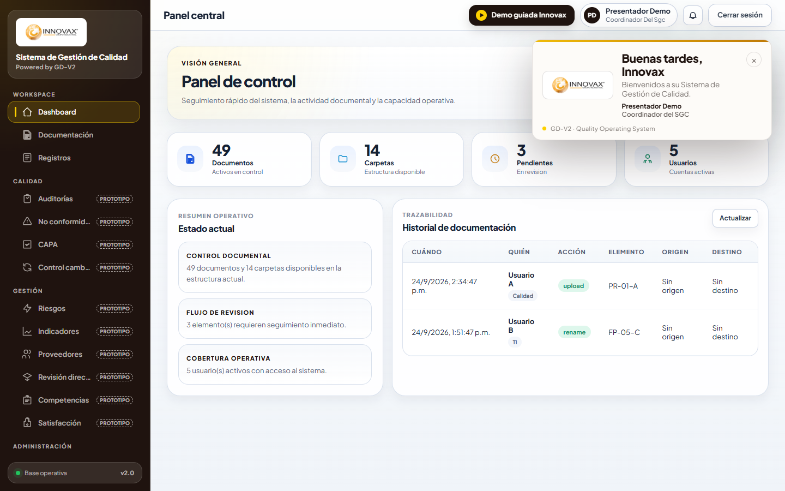
</p>

> Las capturas se tomaron de la interfaz real con **datos de ejemplo** (usuario «Presentador Demo», documentos de muestra), no con información del personal de Innovax.

---

## Contenido

- [Capturas](#capturas)
- [Qué hace](#qué-hace)
- [Demo guiada Innovax](#demo-guiada-innovax)
- [Flujo de revisión y aprobación](#flujo-de-revisión-y-aprobación)
- [Arranque rápido](#arranque-rápido)
- [Pruebas y verificaciones](#pruebas-y-verificaciones)
- [Narración con Dalia (audio pregenerado)](#narración-con-dalia-audio-pregenerado)
- [Seguridad](#seguridad)
- [Estado actual y pendientes](#estado-actual-y-pendientes)
- [Documentación](#documentación)

---

## Capturas

### Acceso y panel central

| Inicio de sesión | Panel central |
|---|---|
| 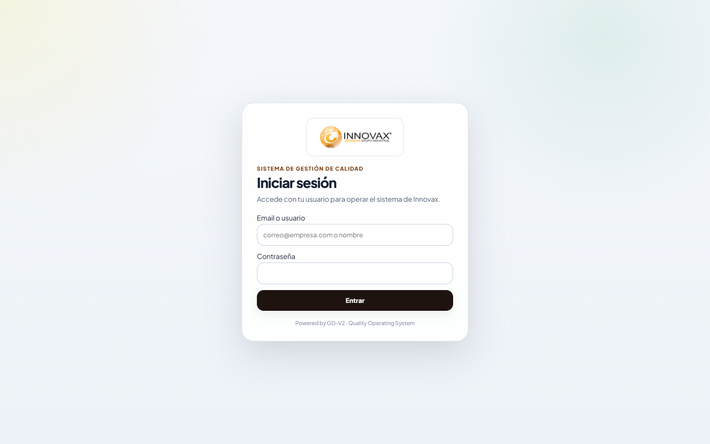 | 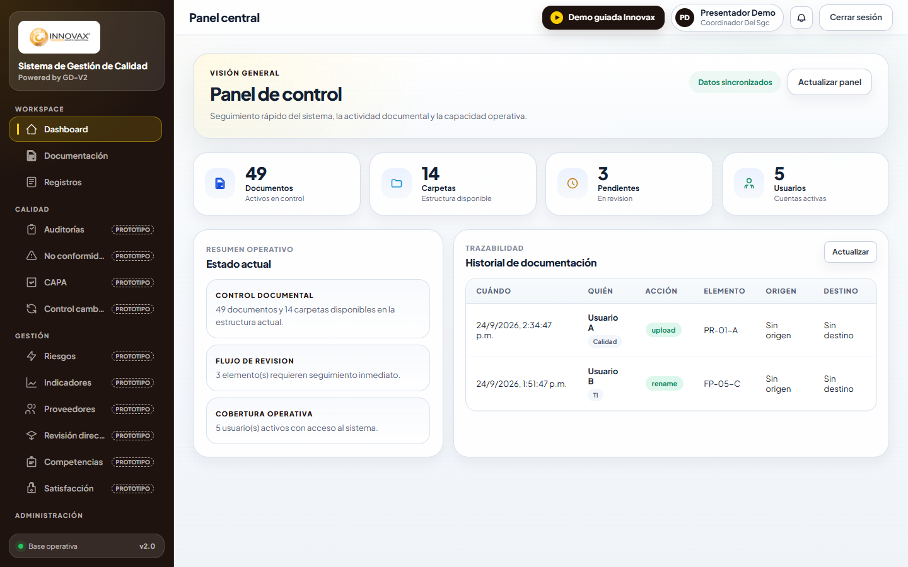 |

### Documentación

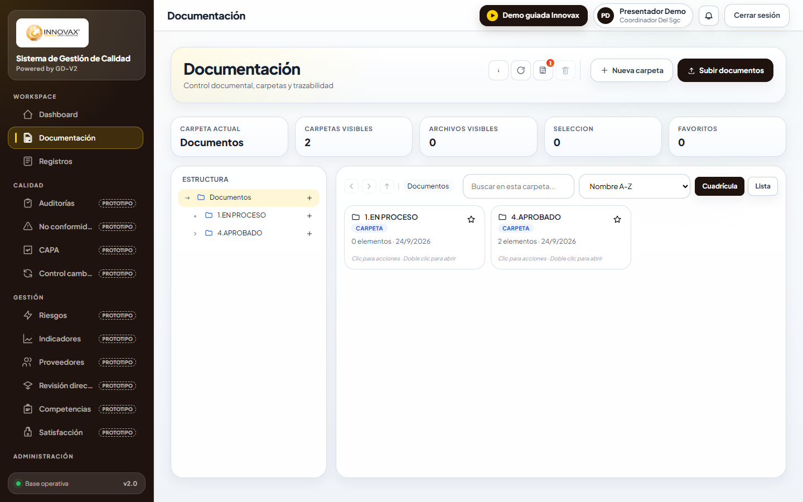

### Demo guiada

| Inicio del recorrido | Paso sobre la pantalla real |
|---|---|
| 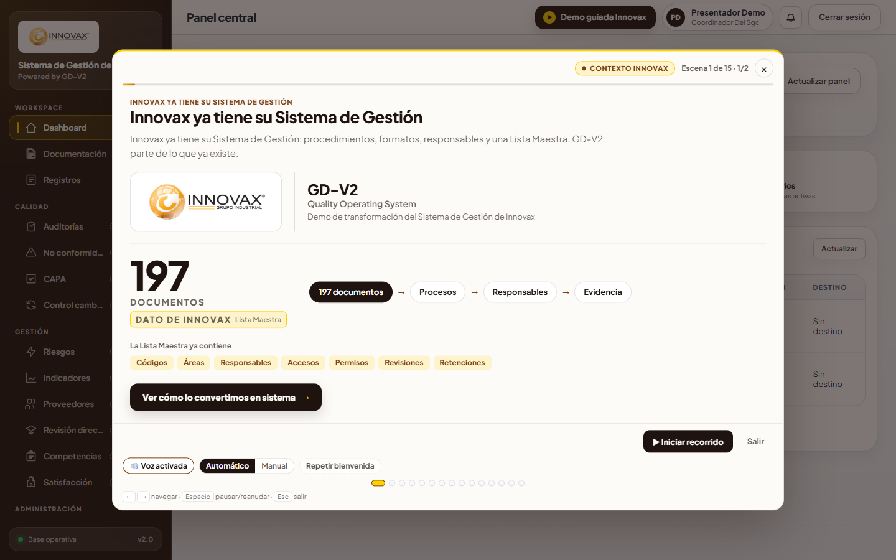 | 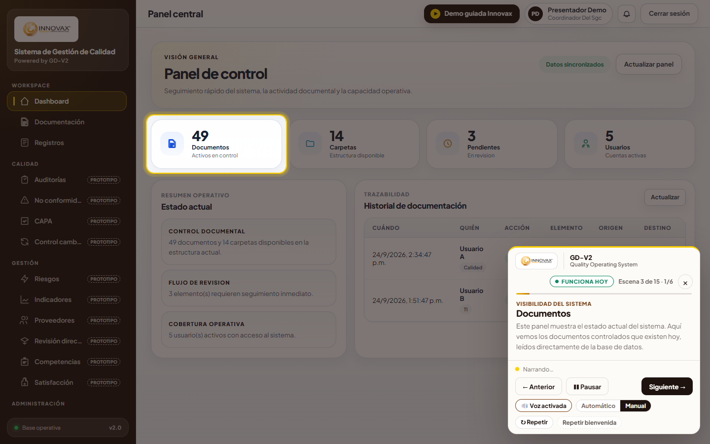 |

### Flujo de revisión: dos caminos

| Bandeja del revisor y las dos ramas | Aprobar (vista previa) |
|---|---|
| 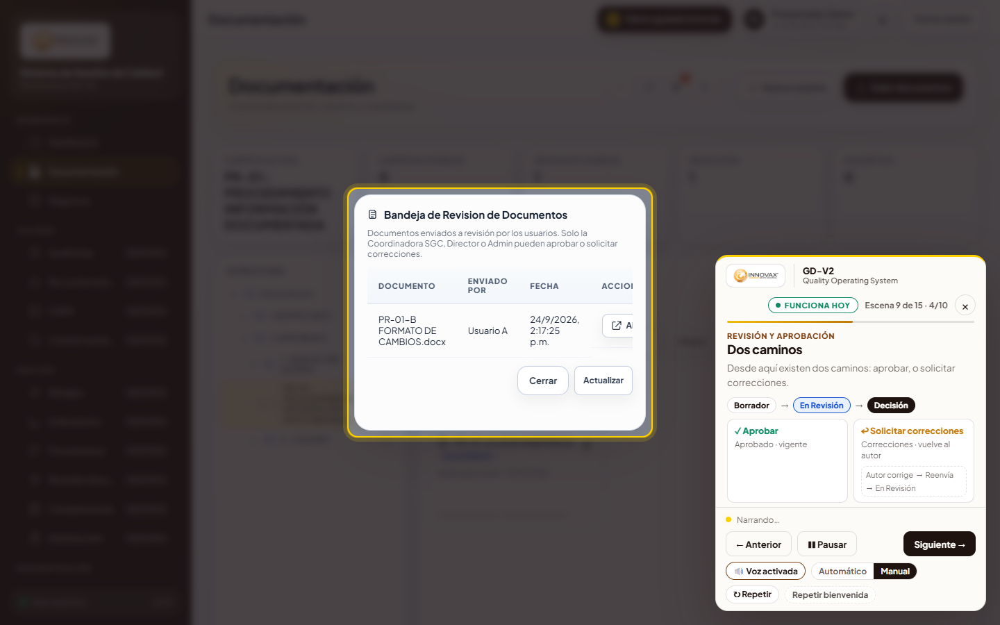 | 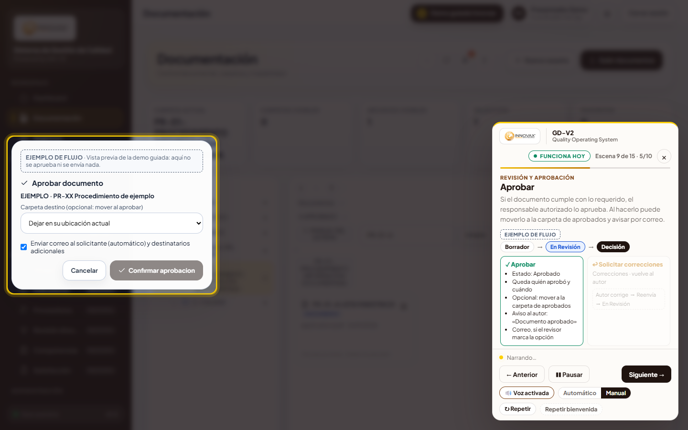 |

| Solicitar correcciones (vista previa) | Notificación por correo |
|---|---|
| 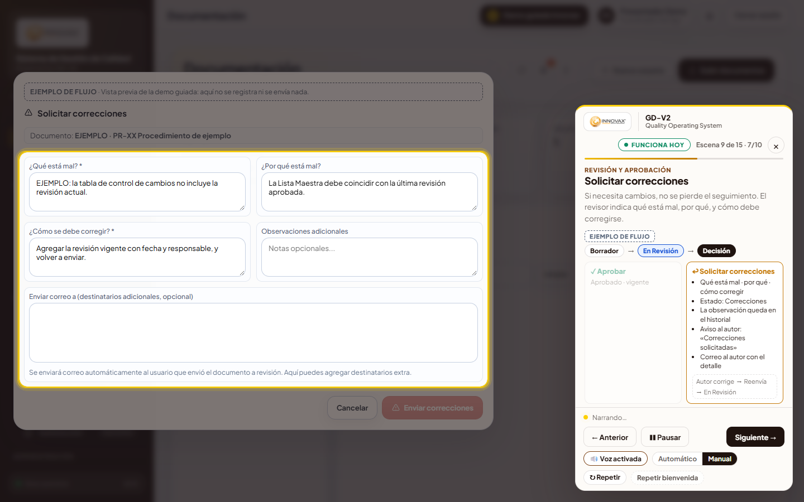 | 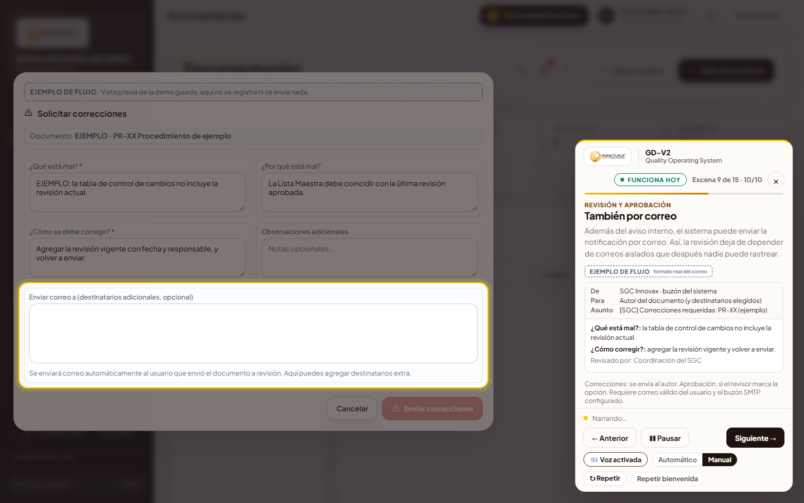 |

### Registros dinámicos y visión

| FP-05-C: el formulario nace de su definición | FP-15-C: de la captura a la decisión |
|---|---|
| 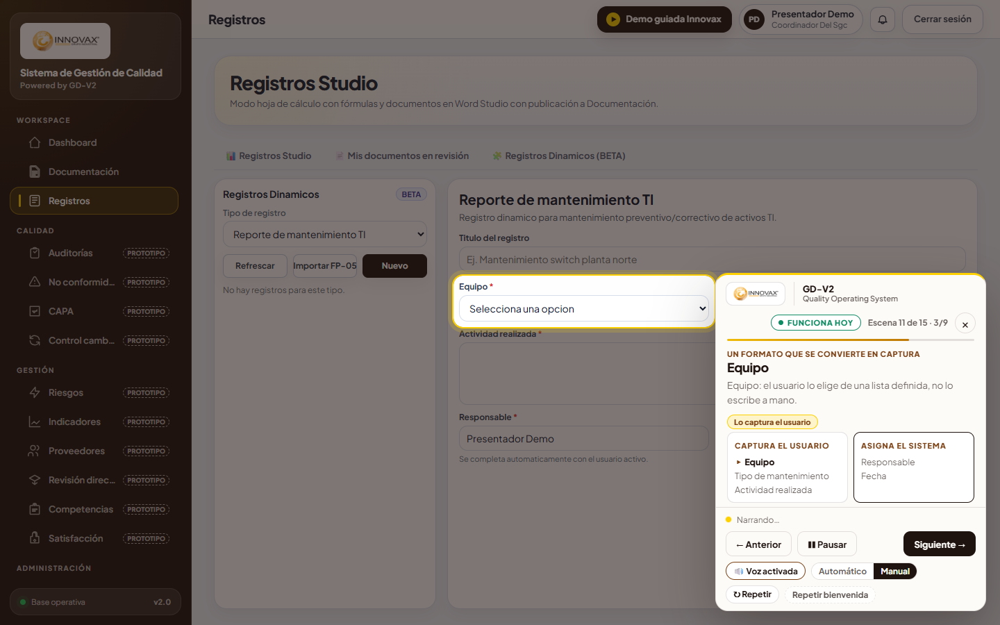 | 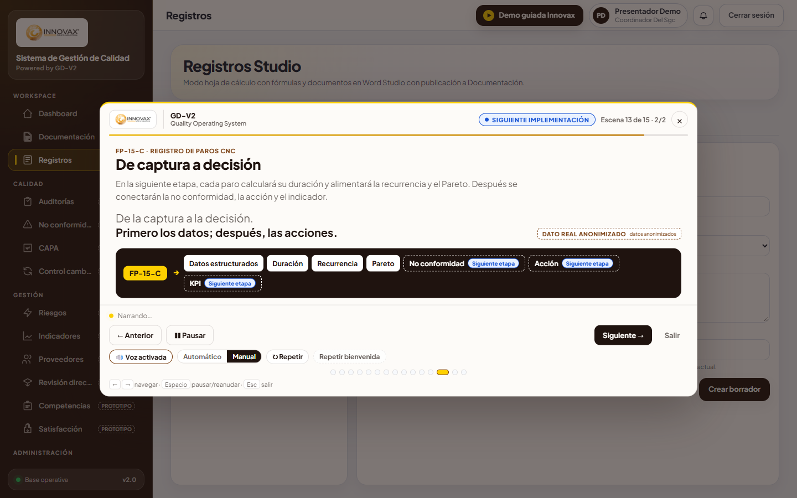 |

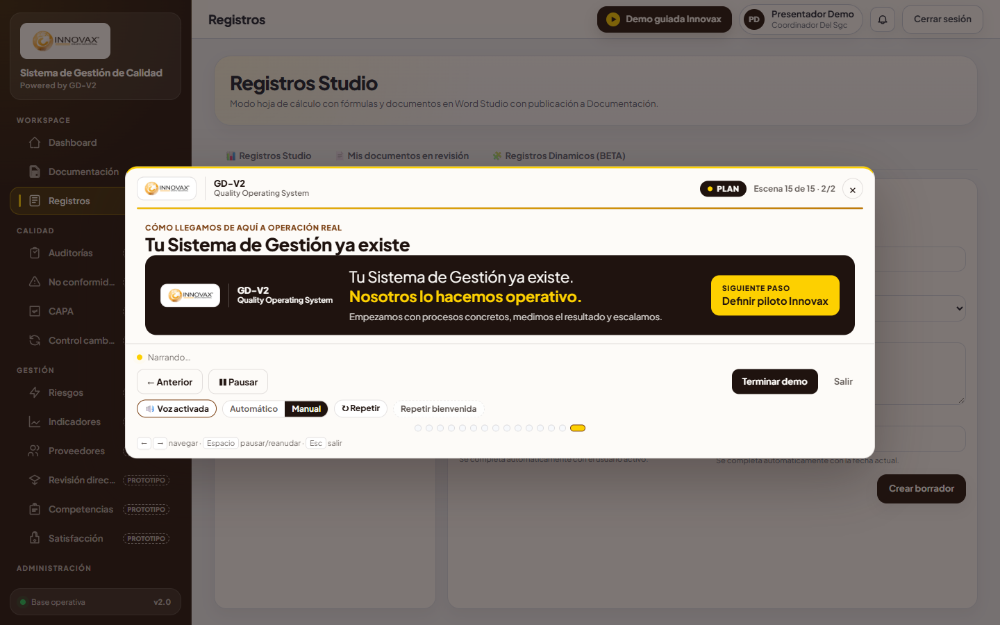

---

## Qué hace

| Área | Estado |
|---|---|
| Inicio de sesión con sesión por ventana y roles | Funciona hoy |
| Panel central con indicadores leídos de la base de datos | Funciona hoy |
| Documentación: carpetas, visor, búsqueda, trazabilidad | Funciona hoy |
| Revisión y aprobación de documentos con notificaciones internas | Funciona hoy |
| Correo de notificación del flujo (SMTP) | Implementado; requiere buzón SMTP y correos de usuario válidos |
| Registros dinámicos (FP-05-C) desde una definición | Funciona hoy (BETA) |
| Auditorías, No conformidades, CAPA, Riesgos, Indicadores y otros módulos | **Prototipo** (datos de ejemplo, marcados en la interfaz) |
| FP-15-C: duración, recurrencia, Pareto, NC, acción, KPI | **Siguiente implementación** |

La interfaz distingue lo que ya funciona de lo que viene: los módulos de prototipo llevan la etiqueta `PROTOTIPO` y la demo usa las etiquetas «Funciona hoy», «Ejemplo de flujo» y «Siguiente implementación».

---

## Demo guiada Innovax

Recorrido de **15 escenas y 53 micro-pasos** sobre la aplicación real. Se abre con el botón **Demo guiada Innovax** de la barra superior.

- **Capa de solo lectura.** Las acciones de la demo pasan por una lista permitida (`src/renderer/demo/actions/policy.ts`) y se bloquean los verbos de escritura: no crea, aprueba, borra ni envía nada.
- **Resaltado sobre la pantalla real.** Cada paso espera a que su elemento exista y esté estable antes de narrar.
- **Modos.** *Automático* (la voz marca el ritmo y el paso avanza al terminar el audio) o *Manual* (el presentador avanza con `→`). `Espacio` pausa y reanuda; `Esc` sale.
- **Bienvenida tras el login.** Tarjeta Innovax y saludo con voz según la hora local:
  - 05:00–11:59 «Buenos días, Innovax. Bienvenidos a su Sistema de Gestión de Calidad.»
  - 12:00–18:59 «Buenas tardes, Innovax. …»
  - 19:00–04:59 «Buenas noches, Innovax. …»

  Suena una vez por inicio de sesión: navegar o abrir y cerrar la demo no la repite, y cerrar sesión la rearma. Los controles de la demo incluyen un botón discreto, **Repetir bienvenida**, para probar el audio antes de una presentación.

Guion y runbook: [`docs/DEMO_INNOVAX_SCRIPT_2026-09-23.md`](docs/DEMO_INNOVAX_SCRIPT_2026-09-23.md) · [`docs/DEMO_INNOVAX_2026-09-23.md`](docs/DEMO_INNOVAX_2026-09-23.md).

---

## Flujo de revisión y aprobación

```
Borrador ──Enviar a revisión──▶ En Revisión ──▶ Decisión del revisor
                                     ▲              │
                                     │              ├─ Aprobar ─────────────▶ Aprobado (vigente)
                                     │              │    · queda quién aprobó y cuándo
                                     │              │    · aviso al autor: «Documento aprobado»
                                     │              │    · correo solo si el revisor marca la opción
                                     │              │
                                     │              └─ Solicitar correcciones ▶ Correcciones
                                     │                   · qué está mal y cómo corregir (obligatorios), por qué (opcional)
                                     │                   · la observación queda en el historial
                                     │                   · aviso al autor: «Correcciones solicitadas»
                                     │                   · siempre se intenta el correo al autor
                                     └──── el autor corrige y reenvía ◀──┘
```

- Al **enviar a revisión**, la Coordinación del SGC recibe el aviso interno «Nuevo documento para revisión».
- En la demo, los diálogos reales de *Aprobar* y *Solicitar correcciones* se abren en **vista previa** con la etiqueta «Ejemplo de flujo» y un documento de ejemplo. Los botones de envío están desactivados y la función que escribe también rechaza la vista previa.

---

## Arranque rápido

Requisitos: Windows, Node.js 22, SQL Server con la base `SGC_Dev` (ver [Respaldos](#respaldos-versionados-git-lfs)).

```powershell
npm install
copy .env.example .env    # completar la conexión a SQL Server; .env nunca se sube a git
npm start                 # renderer (localhost:3002) + proceso main + Electron
```

Conexión recomendada: autenticación de Windows (`SGC_DB_TRUSTED=1`), sin usuario ni contraseña en el archivo.

Build de producción:

```powershell
npm run build
```

Salida: `dist\sgc-desktop-app Setup 0.1.0.exe` y `dist\win-unpacked\`.

> Consejo: si al abrir la app aparece «Cannot access 'NotificacionRepo' before initialization», hay bundles mezclados en `dist/`. Cierra todo y vuelve a arrancar con `npm start`. Las compilaciones de prueba conviene dirigirlas a otra carpeta con `--output-path`.

---

## Pruebas y verificaciones

| Comando | Qué verifica |
|---|---|
| `npm test` | Pruebas unitarias (176): demo, voz, bienvenida, workflow, correo, seguridad |
| `npm run typecheck` | TypeScript sin errores |
| `npm run secret:scan` | Que no haya credenciales ni claves en el repositorio |
| `npm run demo:preflight` | Lista de comprobación antes de presentar |
| `npm run demo:email-test` | Prueba controlada del correo de workflow a Proyectos TI. Sin `-- --send` solo muestra el correo; con `-- --send` envía **uno** y se detiene si el destinatario no es inequívoco |

---

## Narración con Dalia (audio pregenerado)

La voz oficial de la demo es **Dalia Online (Natural) · México**, a velocidad 1.05, con pitch y volumen normales y pausa corta entre frases. La eligió Innovax en una audición.

- **Por qué es audio pregenerado.** Dalia existe en Microsoft Edge y se sintetiza por internet; Electron solo expone las voces locales de Windows. Por eso las 58 narraciones (53 pasos, 2 variantes y 3 saludos) se grabaron una vez y viven en `src/renderer/assets/demo-audio/` (WAV de 24 kHz, unos 7 minutos). **Durante la presentación no se necesita internet.**
- **Cadena de respaldo.** Primero el audio de Dalia. Si falta o falla, esa frase la dice la mejor voz femenina local en español, con el aviso discreto «Voz principal no disponible. Usando voz de respaldo.». Si no hay ninguna voz femenina, la demo sigue en modo manual con subtítulos. **Nunca usa una voz masculina.**
- **Cómo se regeneran.** Se usan `scripts/demo-voice/record-dalia.js` y `scripts/demo-voice/LoopRec.cs`. Edge reproduce a Dalia y una grabadora local captura la salida de audio de Windows, sin claves ni servicios adicionales; los requisitos están en la cabecera del script. Cada audio se identifica por `speechKey(texto)`: si se cambia un texto, `npm test` avisa qué paso quedó sin audio.

---

## Seguridad

- Sin inicio de sesión de desarrollo, sin contraseñas por defecto y sin credenciales en el código. Detalle en [`docs/security/AUTH_HARDENING_0_5.md`](docs/security/AUTH_HARDENING_0_5.md).
- La autorización se decide en el proceso main por sesión; lo que guarda el renderer en `localStorage` es solo un espejo visual.
- `.env` está en `.gitignore`. Cualquier clave (SMTP, servicios de IA) se configura fuera del repositorio.
- Pendientes conocidos: [`docs/security/SECURITY_BACKLOG.md`](docs/security/SECURITY_BACKLOG.md).

---

## Estado actual y pendientes

- **Correo de workflow.** Está implementado y acoplado al flujo. La prueba controlada a Proyectos TI falló por autenticación SMTP (`535`): hay que actualizar la contraseña del buzón en la configuración de correo de la app. Además, varios usuarios no tienen un correo válido registrado, y sin él no reciben el aviso por correo (el aviso interno sí llega).
- **Endurecer la configuración de correo.** Pendiente: proteger las credenciales del buzón SMTP que se guardan en la configuración de la app.
- **FP-15-C y cierre de ciclo** (no conformidad, acción, indicador): siguiente implementación.

---

## Stack

- Electron 28 · React 18 · TypeScript 5 · webpack 5
- SQL Server (`mssql` + `msnodesqlv8`); migraciones en `src/database/migrations-mssql`
- SQLite solo como referencia histórica y apoyo de migración
- Pruebas con `node:test`

## Respaldos versionados (Git LFS)

- `backups/20260303-101847/SGC_Dev_precutover.bak`: restaura la base SQL Server local (`SGC_Dev`).
- `backups/20260303-101847/sgc_precutover.db`: referencia legacy para comparación y migración.

Reglas para asistentes de código: [`AGENTS.md`](AGENTS.md).

## Documentación

- [`docs/DEMO_INNOVAX_2026-09-23.md`](docs/DEMO_INNOVAX_2026-09-23.md): runbook de la demo
- [`docs/DEMO_INNOVAX_SCRIPT_2026-09-23.md`](docs/DEMO_INNOVAX_SCRIPT_2026-09-23.md): guion por micro-paso
- [`documentacion/DEPLOY-DEMO-OTRA-PC.md`](documentacion/DEPLOY-DEMO-OTRA-PC.md): instalación en otra PC
- [`documentacion/FP05C-CASO-REAL.md`](documentacion/FP05C-CASO-REAL.md): caso real FP-05-C
- [`documentacion/AI-CACHE-EXECUTIVE.md`](documentacion/AI-CACHE-EXECUTIVE.md)
